# Yarmarok Project

Yarmarok is a project aimed at organizing local street fairs or bazaars to collect funds for charity or military
support. It provides a platform for managing lots, participants, contributions, and raffles.

## Entities and value objects.

### Organizer

- **ID**: Unique identifier of user account.

### Yarmarok

A Yarmarok represents the overall event and the collection of lots and participants. It has the following properties:

- `ID`: The unique identifier of the Yarmarok.
- `Organizer`: The org of Yarmarok.
- `Name`: The name of the Yarmarok.
- `Lots`: The list of lots associated with the Yarmarok.
- `Participants`: The list of participants associated with the Yarmarok.
- `CreatedAt`: The date of Yarmarok cration.

### Lot

- `ID`: Unique identifier for the lot.
- `Name`: Name of the lot.
- `Cost`: The cost of a single coupon for the lot.
- `Description`:  Optional description of the lot.
- `Participants`: List of participants who have made contributions for this lot.

### Participant

- `ID`: Unique identifier for the participant.
- `Name`: Name of the participant.
- `Phone`: Phone number of the participant.

### Stake

- `ID`: Unique identifier for the stake.
- `LotID`: ID of the lot for which the stake was made.
- `ParticipantID`: ID of the participant who made the stake.
- `Amount`: Amount of money transferred for the stake.
- `Coupons`: Number of coupons obtained for the stake.

## Coupon

```mermaid
graph BT
    add_organizer --> Organizer;
    create_yarmarok --> Yarmarok;
    delete_yarmarok --> Yarmarok;
    create_lot --> Lot;
    create_person --> Participant;
    add_participant_to_lot --> Participant;
    add_participant_to_lot --> Lot;
    add_coupons --> Lot;
    list_stakes --> Stake;
    delete_stake --> Stake;
    list_lots --> Lot;
    list_of_participants_per_lot --> Participant;
    list_of_participants_per_lot --> Lot;
    list_participants --> Participant;
    list_participants_ids --> Participant;
    list_participants_names --> Participant;
    lot_view --> Lot;
    play_lot --> Lot;
    play_lot_additional_actions --> Lot;
```

## Functions

The **Yarmarok** project includes the following functions:

| Function                       | Description                                                                                                                       |
|--------------------------------|-----------------------------------------------------------------------------------------------------------------------------------|
| `add_organizer`                | Creates a new organizer with the specified account ID.                                                                            |
| `create_yarmarok`              | Creates a new Yarmarok with the specified name.                                                                                   |
| `delete_yarmarok`              | Deletes the specified Yarmarok.                                                                                                   |
| `create_lot`                   | Creates a new lot with the specified name, description, and cost.                                                                 |
| `create_participant`           | Creates a new participant with the specified name, phone, and email.                                                              |
| `add_participant_to_lot`       | Adds a participant to a lot, recording their contribution in the process.                                                         |
| `add_coupons`                  | Adds coupons to a lot, increasing the number of available coupons.                                                                |
| `delete_stake`                 | Deletes a stake made by a participant for a specific lot.                                                                         |
| `list_lots`                    | Retrieves a list of all lots in the system.                                                                                       |
| `list_of_participants_per_lot` | Retrieves a list of all participants for a specific lot.                                                                          |
| `list_participants`            | Retrieves a list of all participants in the system.                                                                               |
| `list_participants_ids`        | Retrieves a list of IDs for all participants in the system.                                                                       |
| `list_participant_names`       | Retrieves a list of names for all participants in the system.                                                                     |
| `list_stakes`                  | Retrieves a list of stakes for a specific lot.                                                                                    |
| `lot_view`                     | Displays details of a lot, including name, description, cost, and participant list.                                               |
| `play_lot`                     | Performs the raffle for a lot, randomly selecting a winner based on the number of coupons.                                        |
| `play_lot_additional_actions`  | Performs additional actions after the raffle, such as sending a message to the winner or saving the raffle results in a database. |
