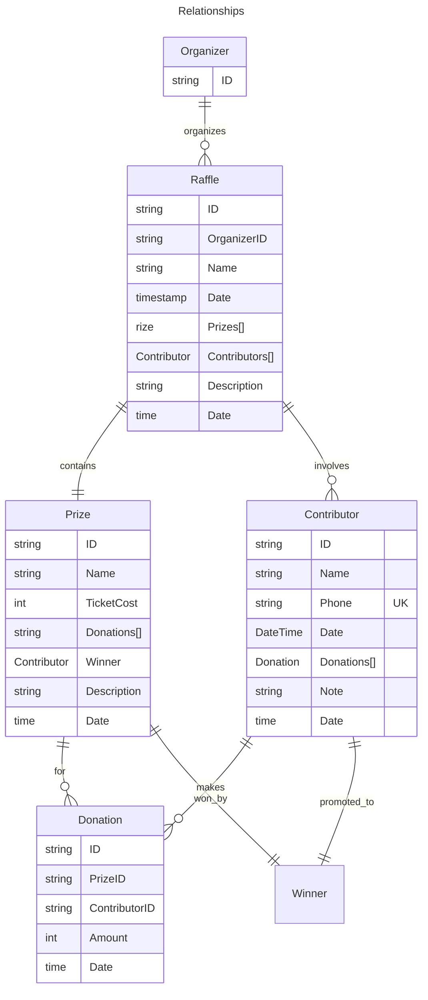

# Yarmarok

An app to make charity auctions smoother
The project aimed at organizing local street fairs or bazaars to collect funds for charity or military
support.
It provides a platform for managing lots, participants, donations, and raffles.

## Entities and value objects
### Organizer

- **ID**: Unique identifier of user account.

### Raffle

A raffle represents the overall event and the collection of lots and participants. It has the following properties:

- `ID`: The unique identifier of the raffle.
- `Organizer`: The org of raffle.
- `Name`: The name of the raffle.
- `Description`: Optional description of the raffle.
- `Prizes`: The list of prizes associated with the raffle.
- `Contributors`: The list of contributors associated with the raffle.
- `Date`: The date of raffle creation.

### Prize

- `ID`: Unique identifier for the lot.
- `Name`: Name of the lot.
- `TicketCost`: The cost of a single ticket for the lot.
- `Description`:  Optional description of the prize.
- `Donations`: List of contributors who have made donation for this lot.
- `Winner`: The winner of the raffle for this lot. **Field is not finalized.**
- `Date`: The date of prize creation.

### Contributor

- `ID`: Unique identifier for the participant.
- `Name`: Name of the participant.
- `Phone`: Phone number of the participant.
- `Note`: Optional note about the participant.
- `Date`: The date of contributor creation.

### Donation

- `ID`: Unique identifier for the donation.
- `PrizeID`: ID of the lot for which the donation was made.
- `ContributorID`: ID of the contributor who made the donation.
- `Amount`: Amount of money transferred for the donation.
- `Date`: The date of the donation.

### Diagrams



## Running the project

### Prerequisites

- [Go](https://golang.org/doc/install)
- [Task](https://taskfile.dev/#/installation)
- [Docker](https://docs.docker.com/get-docker/)
- [Mockgen](https://github.com/golang/mock#installation)

Quick install of go Task:

```bash
go install github.com/go-task/task/v3/cmd/task@latest
```

### Run tasks

```bash
task test # run tests
task integration-test # run heavy integration tests
task generate # generate mocks
```